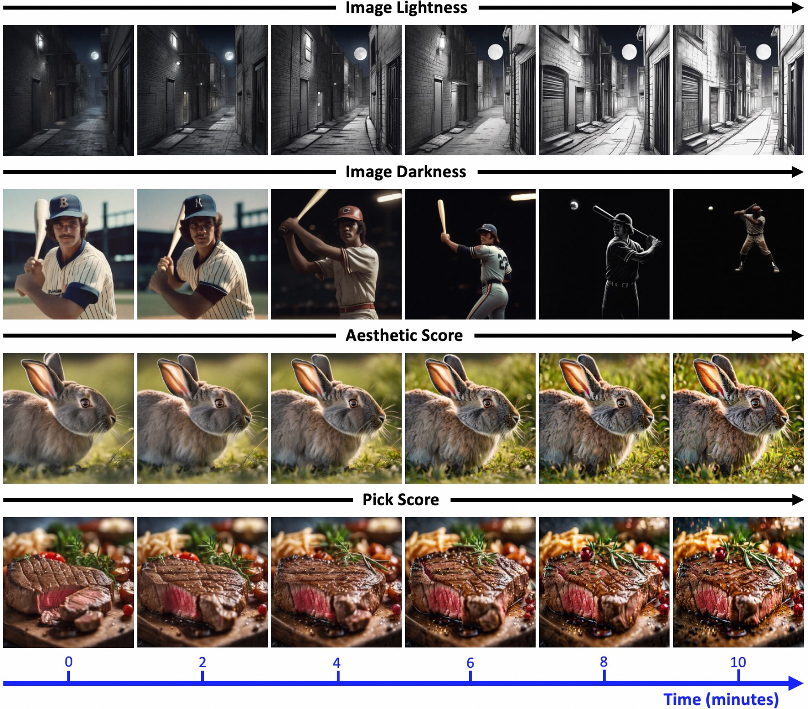
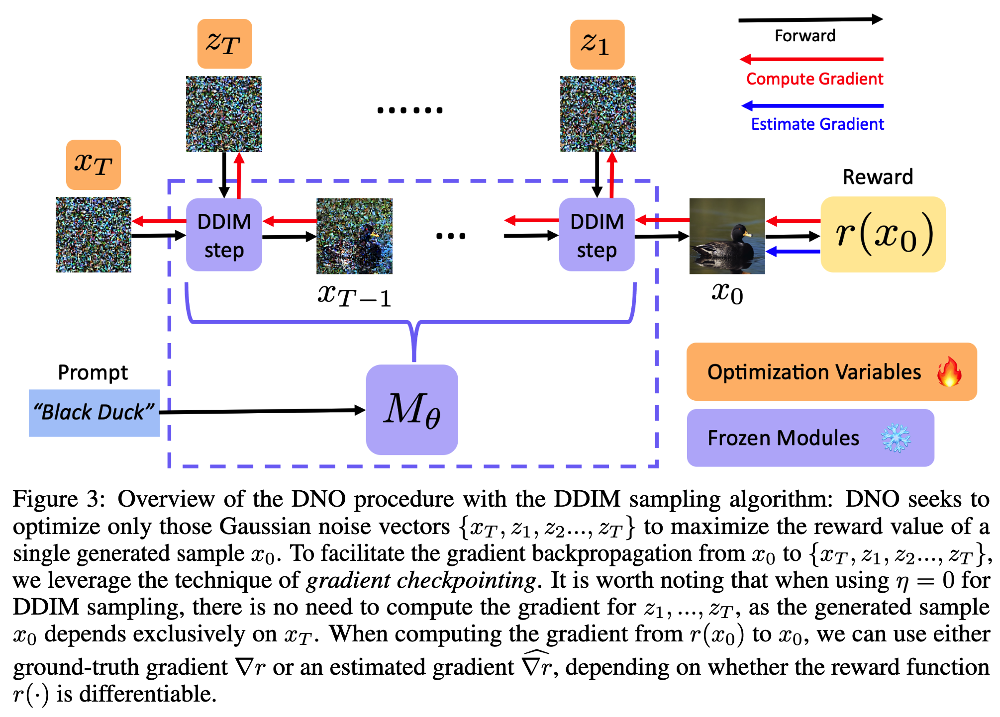
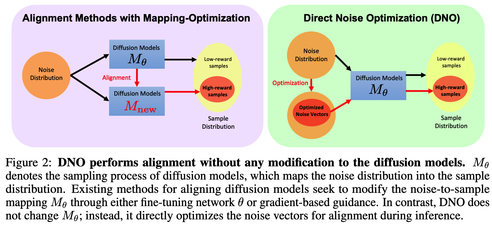
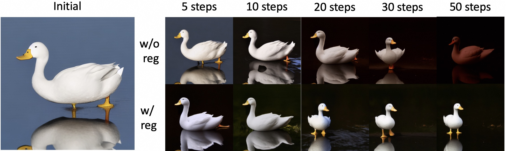

# Direct-Noise-Optimization (DNO) for Inference-Time Alignment of Diffusion Generative Models

This is the official repo for the paper "Tuning-Free Alignment of Diffusion Models with Direct Noise Optimization" Tang et al. 

[arxiv version](https://arxiv.org/abs/2405.18881)


# News 🔥

* **2024/07/*20***: The major codebase and a tutorial on DNO are released.  🔥🔥
* **2024/06/16**: A short version of this paper is accepted to 2nd SPIGM workshop @ ICML 2024. 🔥🔥


# Demo: Aligning the output of SDXL with DNO

Our proposed method can align the output of SDXL with DNO **within 10 minutes** on a single 80GB A100 GPU. The following demo shows the evolution of images during the alignment process.




# 1. Introduction

## Methodology

Our method is visualized as follows. The key idea is to observe that the sampling process is a noise-to-sample mapping. We formulate the alignment problem, i.e., generating a high-reward sample, as finding optimal initial noise vectors.
.

**Note that our method can handle both differentiable and non-differentiable reward models. When the reward is non-differentiable, we propose a hybrid gradient approximation method to approximate the gradient of the reward models. **

**We also observe that DNO can be subject to Out-Of-Distribution Reward-Hacking, which can be prevented by using probability regularization. In brief, the idea is to regularize the noise vectors to stay within the high-probability region of the Gaussian distribution.
**

## How does DNO differ from other alignment methods?



# 2. Running DNO codebase

## Environment
```bash
conda env create -f environment.yml
conda activate dno
```


## Useful Open-Sourced Pretrained Models

To run this code, you should download several existing reward models and pretrained diffusion models from the following links:

* Aesthetic Score: https://github.com/LAION-AI/aesthetic-predictor
* HPS Score: https://github.com/tgxs002/HPSv2
* PickScore: https://github.com/yuvalkirstain/PickScore
* Stable Diffusion v1.5: https://huggingface.co/runwayml/stable-diffusion-v1-5
* Stable Diffusion XL: https://huggingface.co/stabilityai/stable-diffusion-xl-base-1.0

After downloading these reward models locally, one should replace the model addresses in `rewards/rewards_zoo.py`.


## Tutorial: Implementing DNO with a toy diffusion model 🔥

We provide a comprehensive tutorial in the `tutorial` folder, available [here](tutorial/simple_dno.ipynb). This tutorial covers training a toy diffusion model from scratch and implementing DNO with both differentiable and non-differentiable reward functions, **all with minimal code.**


## Running DNO with SD v1.5
In the following command, we provide an example of running DNO with SD v1.5, both with and without probability regularization.  The main script is `dno_stable_diffusion.py`.
```bash
# see the parameters of the script
python dno_stable_diffusion.py -h

# example: optimizing with darkness reward and prompt "white duck", default is no probability regularization
python dno_stable_diffusion.py --prompt "white duck" --objective black --lr 0.001

# Preventing Out-of-Distribution Reward-Hacking with Probability Regularization by setting gamma to be nonzero
python dno_stable_diffusion.py --prompt "white duck" --objective black --gamma 1
```
The evolution of the optimized images will be saved in the `output` folder.

An example below demonstrates the effect of probability regularization. With our proposed probability regularization technique, the optimized images with DNO are always adhere to the prompt "white duck" during the alignment process.


## Optimizing non-differentiable reward functions with DNO

In the following command, we provide an example of running DNO with SD v1.5 to tackle non-differentiable reward models. We use the hybrid gradient approximation method to approximate the gradient of the reward models. As discussed in the paper, since the gradient approximation can be more accurate with more samples, we provide a script that can distribute the sample generation process across multiple GPUs, thereby speeding up the gradient approximation process.

In the implementation in `dno_stable_diffusion_nograd.py`, we assume that there are at least 2 GPUs: GPU 0 is responsible for computing the ground-truth gradient for the noise-to-sample mapping, while the remaining GPUs generate perturbed samples to compute the gradient approximation of reward functions. The more GPUs provided, the more accurate the estimated gradient at each gradient step.

```bash
# see the parameters of the script
python dno_stable_diffusion_nograd.py -h

# Example: running the optimization on 2 GPUs for maximizing jpeg compressibility
accelerate launch --num_processes 2 dno_stable_diffusion_nograd.py --prompt "white duck" --objective jpeg --lr 0.01
```


## Running DNO with SDXL

In the last script `dno_sdxl.py` , we provide an example of running DNO with SDXL, which was used to generate the demo above. Note that running this code on a single GPU requires **approximately 50 GB of memory**.
```bash
# see the parameters of the script
python dno_sdxl.py -h

# A simple example
python dno_sdxl.py --prompt "white duck" --objective black --lr 0.001
```


# 3. Running DNO with custom reward functions 🔥

In this codebase, all the used reward functions are maintained in the script `rewards/rewards_zoo.py`. In the following code, we describe the format for building your custom reward functions.
```python
# The format for custom reward function.
# The output is loss, i.e., negative of reward function.
def custom_loss_fn(inference_dtype = None, device = None): 
		# load your model here
    your_model = None
  	
    # If your wish to do optimization with gradient.
    # The loss_fn must be differentiable w.r.t im_pix_un.
    def loss_fn(im_pix_un, prompts):
      # denormalize the image output from diffusion model
      im_pix = ((im_pix_un / 2) + 0.5).clamp(0, 1)  
      # do the inference here
      scores = your_model(im_pix, prompts)
      loss = - scores
      return loss

# An example of constructing the loss function for PickScore
def pick_loss_fn(inference_dtype=None, device=None):
    from open_clip import get_tokenizer

    model_name = "ViT-H-14"
    model = AutoModel.from_pretrained(PICK_SCORE_PATH) 
    
    tokenizer = get_tokenizer(model_name)
    model = model.to(device, dtype=inference_dtype)
    model.eval()

    target_size =  224
    normalize = torchvision.transforms.Normalize(mean=[0.48145466, 0.4578275, 0.40821073],
                                                std=[0.26862954, 0.26130258, 0.27577711])
        
    def loss_fn(im_pix_un, prompts):    
        im_pix = ((im_pix_un / 2) + 0.5).clamp(0, 1) 
        x_var = torchvision.transforms.Resize(target_size)(im_pix)
        x_var = normalize(x_var).to(im_pix.dtype)        
        caption = tokenizer(prompts)
        caption = caption.to(device)
        image_embs = model.get_image_features(x_var)
        image_embs = image_embs / torch.norm(image_embs, dim=-1, keepdim=True)
    
        text_embs = model.get_text_features(caption)
        text_embs = text_embs / torch.norm(text_embs, dim=-1, keepdim=True)
        # score
        scores = model.logit_scale.exp() * (text_embs @ image_embs.T)[0][0]
        loss = - scores
        return  loss
    
    return loss_fn
```

After creating your own reward function, the next step is to add it into `rewards/__init__.py`, see the following code for example.

```python
from .rewards_zoo import *

RFUNCTIONS = {
    "aesthetic" : aesthetic_loss_fn,
    "hps" : hps_loss_fn,
    "pick" : pick_loss_fn,
    "white" : white_loss_fn,
    "black" : black_loss_fn,
    "jpeg": jpeg_compressibility,
    "A_Short_Name_For_Your_Reward_Function": custom_loss_fn
}
```

After this step, you will be able to optimize your custom reward function with the scripts in the previous section, for example:

```bash
# optimizing your custom reward function for SD v1.5
python dno_stable_diffusion.py --prompt "white duck" --objective A_Short_Name_For_Your_Reward_Function
```


# If you found this code useful, please cite our paper:


```latex
# A short version in ICML 2024 Workshop
@inproceedings{
tang2024tuningfree,
title={Tuning-Free Alignment of  Diffusion Models with Direct Noise Optimization},
author={Zhiwei Tang and Jiangweizhi Peng and Jiasheng Tang and Mingyi Hong and Fan Wang and Tsung-Hui Chang},
booktitle={ICML 2024 Workshop on Structured Probabilistic Inference {\&} Generative Modeling},
year={2024},
url={https://openreview.net/forum?id=Dqpa8rbL39}
}

# Full Arxiv version
@misc{tang2024tuningfreealignmentdiffusionmodels,
      title={Tuning-Free Alignment of Diffusion Models with Direct Noise Optimization}, 
      author={Zhiwei Tang and Jiangweizhi Peng and Jiasheng Tang and Mingyi Hong and Fan Wang and Tsung-Hui Chang},
      year={2024},
      eprint={2405.18881},
      archivePrefix={arXiv},
      primaryClass={cs.LG},
      url={https://arxiv.org/abs/2405.18881}, 
}
```

